# 🇰🇷 대한민국 (South Korea)

## 1. 도시

[:lucide-map-pin: 서울](seoul.md){ .info-button }

---

## 2. 스타벅스 머그

### 2.1. 디스커버리 시리즈

  <article class="mug-card">
    <strong>KOREA</strong>

    

      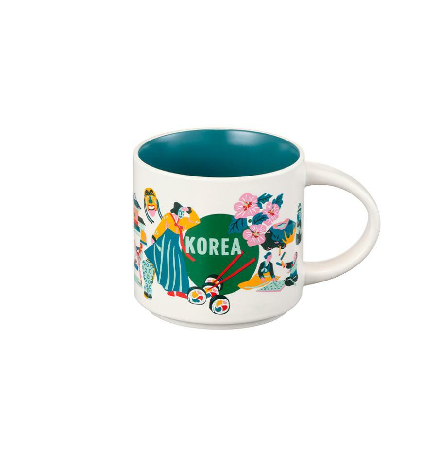
    

  </article>

### 2.2. 안녕 시리즈

대한민국 지도 위에 안녕 시리즈 머그의 지역을 표시합니다. 핀을 누르면 지역명을 확인할 수 있습니다.

  <article class="mug-card">
    <strong>강원</strong>

    

      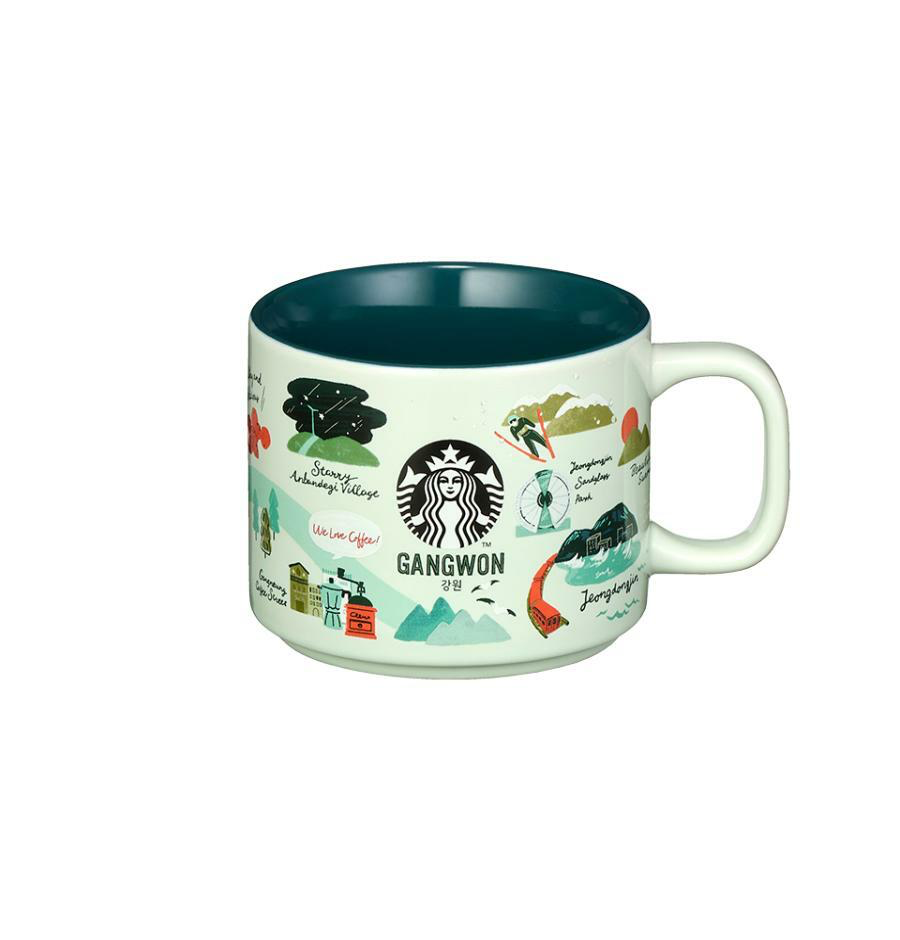
    

  </article>
  <article class="mug-card">
    <strong>경기</strong>

    

      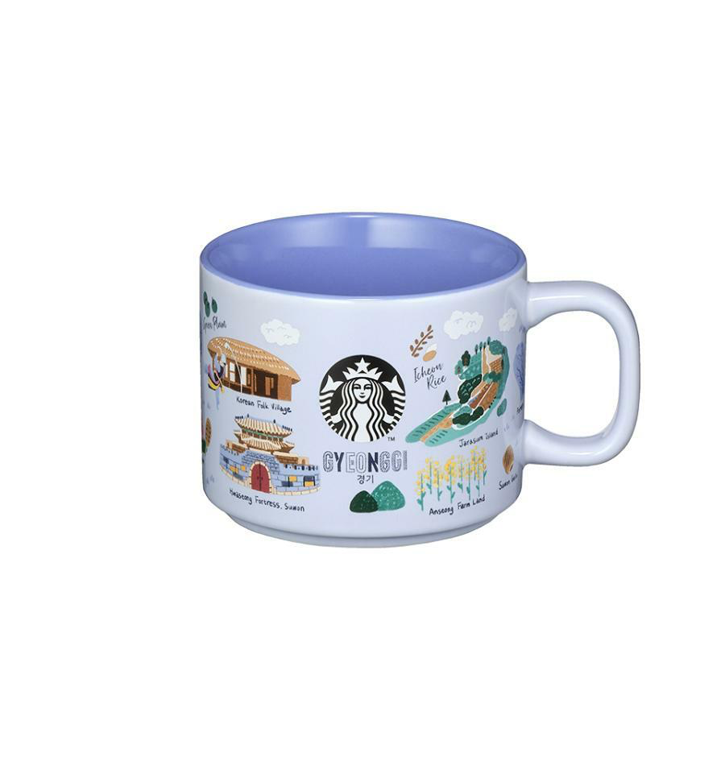
    

  </article>
  <article class="mug-card">
    <strong>경상</strong>

    

      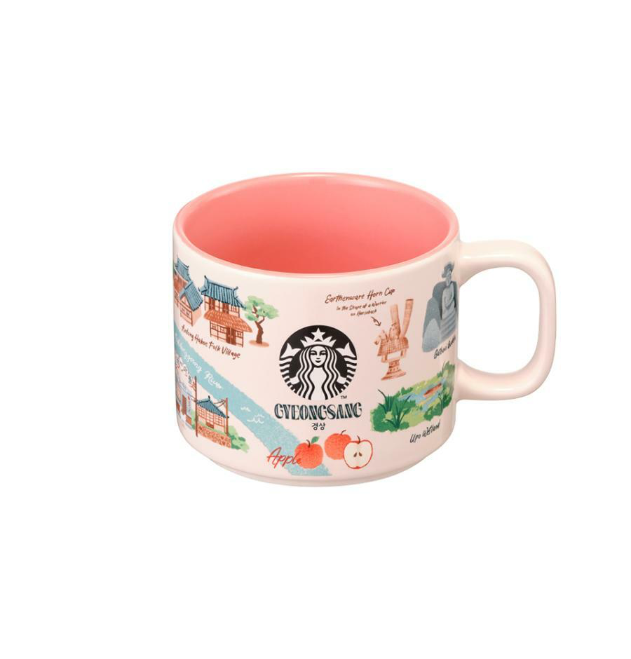
    

  </article>
  <article class="mug-card">
    <strong>경주</strong>

    

      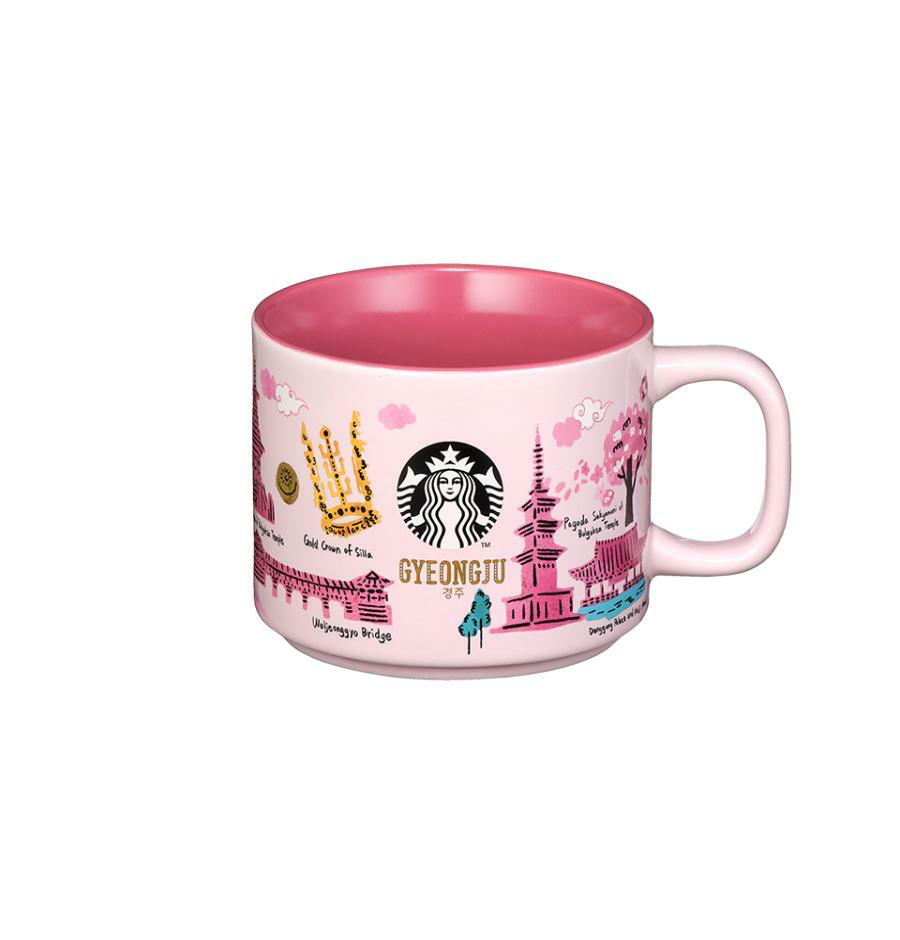
    

  </article>
  <article class="mug-card">
    <strong>부산</strong>

    

      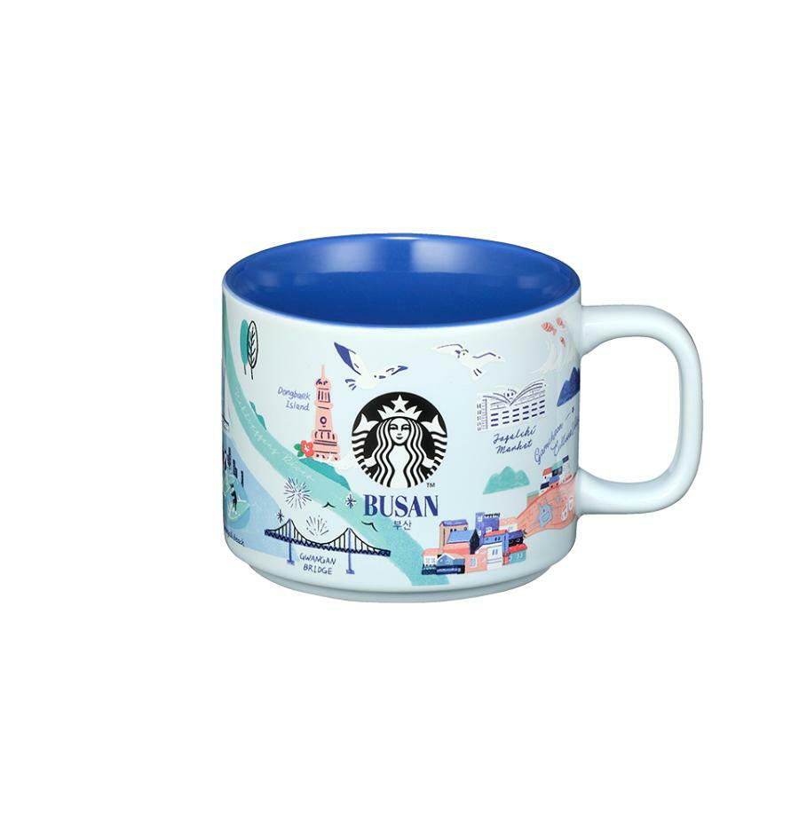
    

  </article>
  <article class="mug-card">
    <strong>서울</strong>

    

      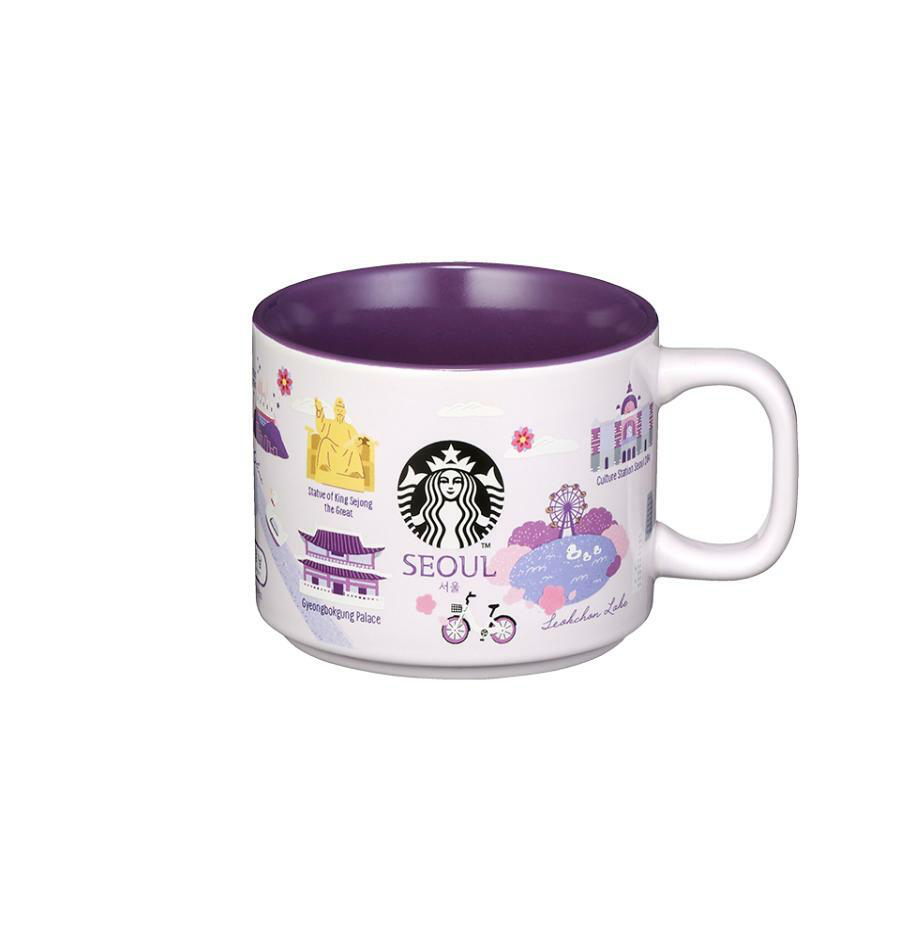
    

  </article>
  <article class="mug-card">
    <strong>인천</strong>

    

      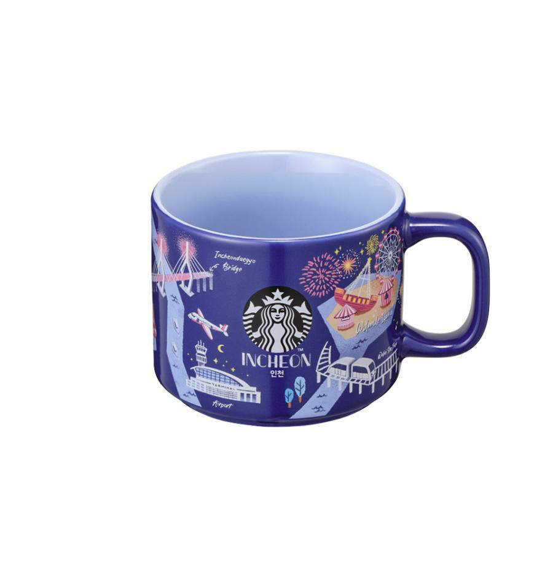
    

  </article>
  <article class="mug-card">
    <strong>전라</strong>

    

      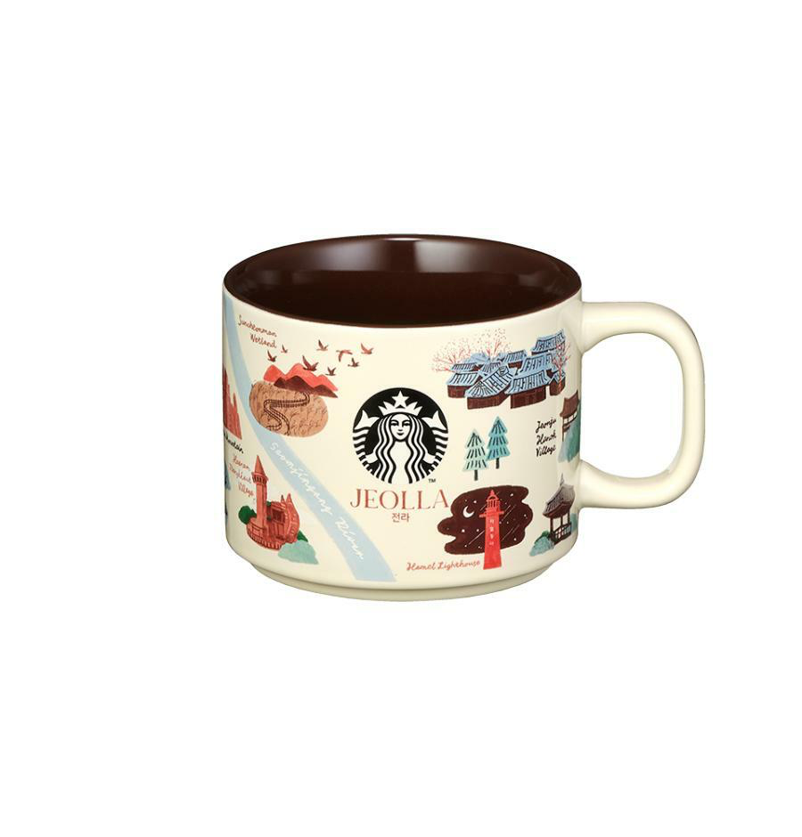
    

  </article>
  <article class="mug-card">
    <strong>제주</strong>

    

      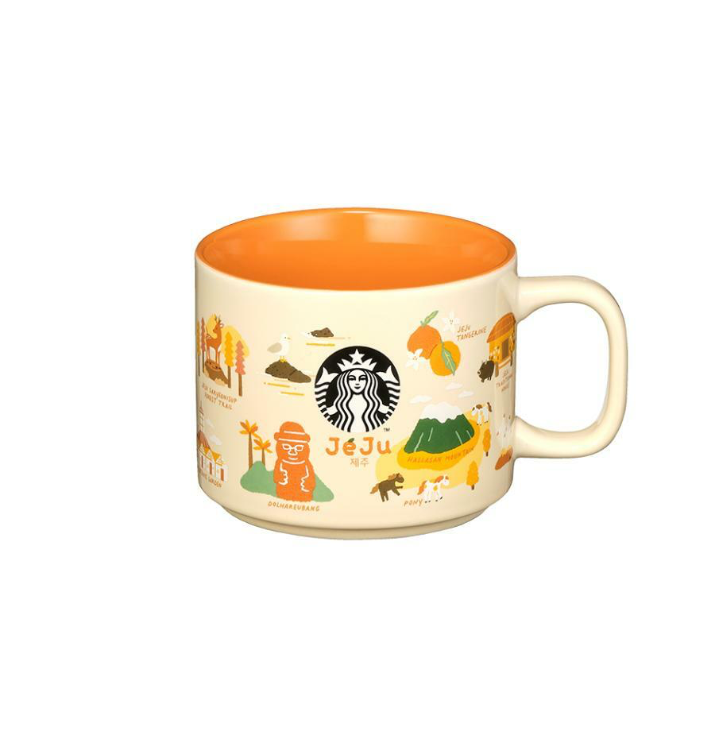
    

  </article>
  <article class="mug-card">
    <strong>충청</strong>

    

      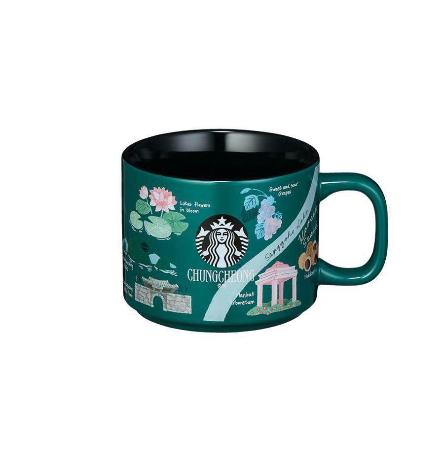
    

  </article>

[:lucide-house: 홈으로 돌아가기](../../index.md){ .home-return-link }

